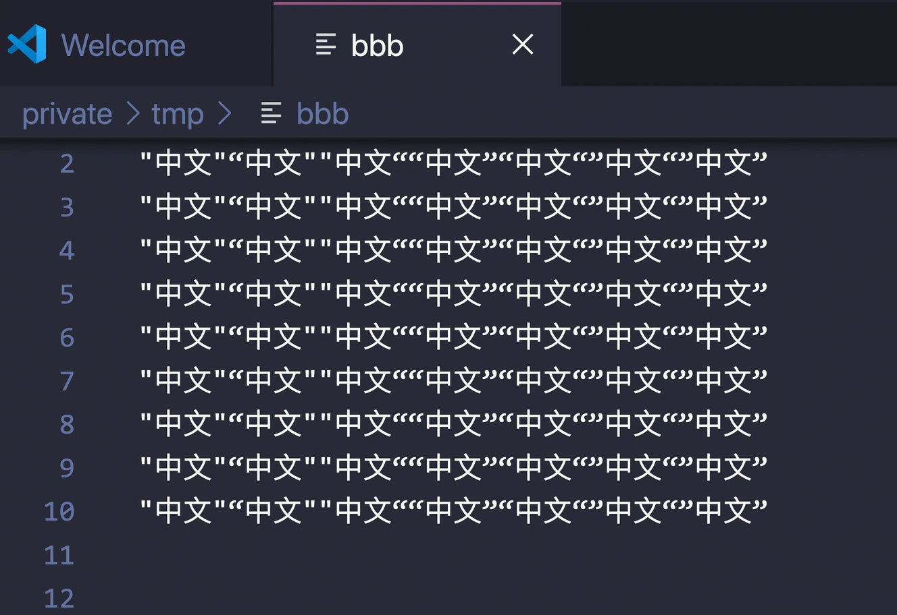

# SmartQuote

SmartQuote 插件用于自动修正中文文档里的引号。它假设 `“` 和 `”` 应当依次轮流出现。比如如下这行

> "中文"“中文""中文”“中文”“中文“”中文“”中文”

应当被修正为

> “中文”“中文”“中文”“中文”“中文”“中文”“中文”

## 功能

## 已知问题

目前无法处理多个不连续选择的情况。

## 版本信息

### 0.0.1

初始版本

## License

MIT

